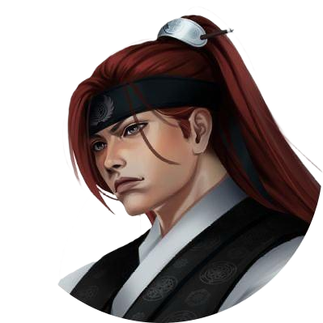
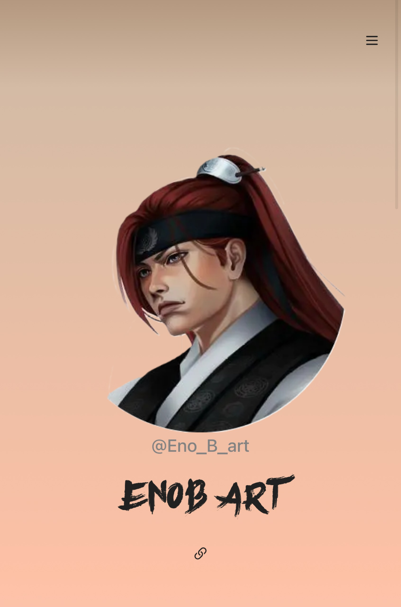

# EnoB ART Portfolio Website 🖌️

A portfolio website showcasing the work of enob art, her services and methods.

## 🚀 Tech Stack
- **Frontend:** React, Next.js and TypeScript.
- **Backend:** Supabase for database and admin authintication, Node.js.
- **Styling:** Tailwind CSS, Shadcn and other custom CSS.
- **Contact:** Resend for the contact form.

## ✨ Features
- Showcasing the work of EnoB ART with a full gallery.
- A list of the services provided and the methods used to create the art.
- 3 themes to choose from, light, dark and colorful.

## 🧑‍💻 Technical
- Admin page to allow the owner full control and customization of the website.
- Responsive layout with carousel for phone view.
- A contact form connected to the owners email.

## 📸 Main Menu

## 🎥 Video showcase of the project
[▶️ Watch on YouTube](https://www.youtube.com/shorts/_wskh1OM3TY)

## 🔗 Check the live website
👉 [EnoB Art Portfolio](https://enobart.hiyume.games)